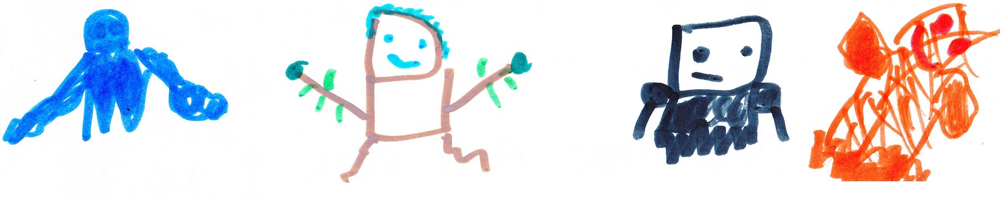

# Herobrine Returns

{width=600px}

Herobrine came out and said, “Come and get me!”  I said, ”No.” Herobrine said, “I just wanted you to get a look at me. I will come back in an hour to kill you.”  Then he went away. 

*At my base...*

I said, “Malek, what data did you collect?”  Malek said, “The gems we have can turn us into gods. The bad guys want to get the gems so they can turn into gods.”

*One hour later...*

Herobrine came out of the portal. My team and I got out of my base. The fight was long but at the end I turned into the Life God. That guy's weakness is things that contain good magic like trees, good guys and basically earth. I almost shut off Herobrine but he ran away before I could deactivate him. After that I took a nap. When I woke up I said, “It's time we raid Herobrine's base.”
