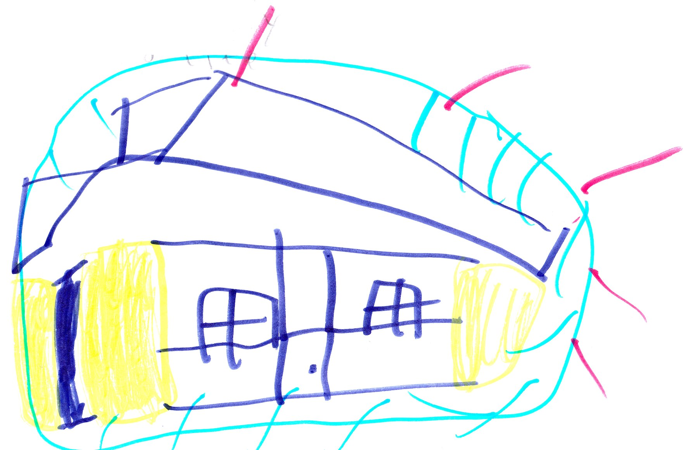

# The Bad Guy Survival on Earth

{width=600px}

It would take a year to fix the base in the End. After the base was destroyed, Herobrine put his base on Earth. Since Herobrine has never lived on earth it was hard to survive. Herobrine was always mad on Earth. 

One day Cindy was sent to the mines. Cindy found our Mineshaft and went inside. She found a door and opened it. Inside was where we found King Creeper but this time it was all decorated with zombie decorations. Cindy looked  around and then she heard someone say in a deep voice, “Cindy, I was looking for you.” Cindy said, “King Zombie!”
