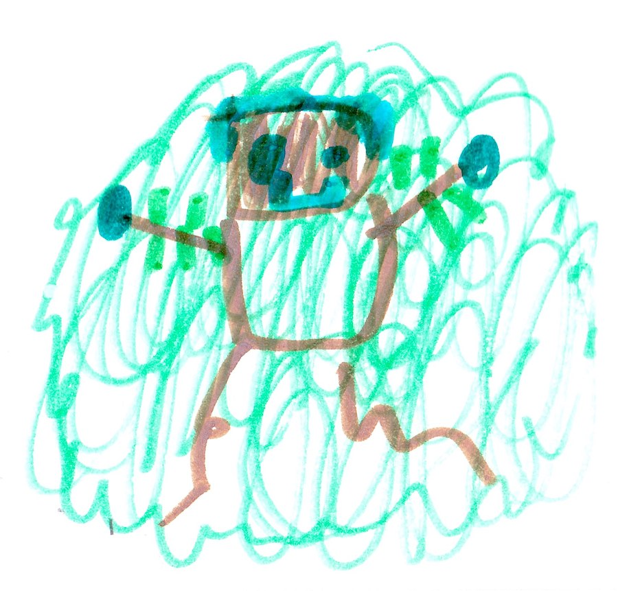

# The Battle of Our Lives

Herobrine left King Zombie in charge while he fought me. He took Cindy, Will, and the army of Enderman to our base. When Herobrine got to my base, he said, “Come out Beckett.” I said, “Everyone come out.” Then I said, “This is a job for the Life God.” When I turned into the Life God there was a force field that things with bad magic can't go through. When everyone came out I said, “Everyone fight Herobrine's Enderman, and I'll fight Herobrine.”

{width=400px}

*One hour later...*

I said, “We are losing the battle.” The Villagers saw and decided to help. I said, “The villagers were saved. Now it is just us and Herobrine.” 

