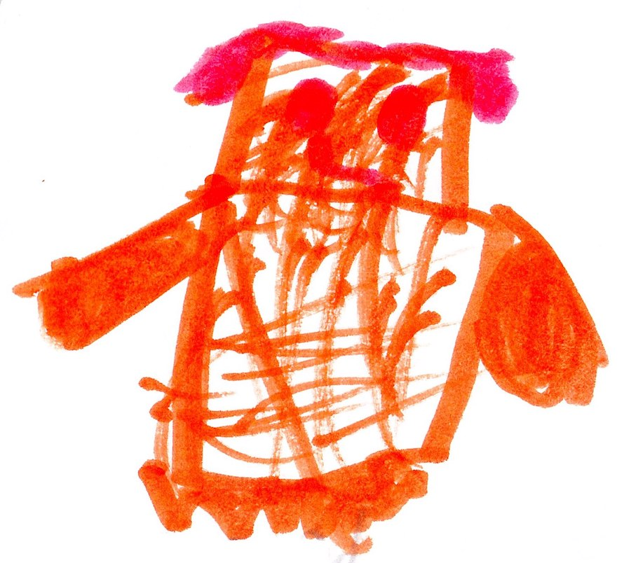

# Herobrine and Us

Our team thought we had the advantage but we were wrong. Soon everybody was hurt but me. It was because of my life shield. I said, “Guys we can't give up.” Then I saw the Fire Gem fly   towards Felix. Then Felix turned into the Fire God. Felix and I fought Herobrine but Felix wasn't used to his power so after a while he would lose his power. As soon as Felix lost his power Herobrine picked up the Fire Gem and said, “Yes...more...MORE!”  as he turned into the Fire God.

{width=300px}

I called Everyone else and said, “Help!” Everyone came. Then a portal opened. I said, “Steve, I was wondering where the Magic Gem was, and now I know you are the magic god.” he hit Herobrine but it didn't do a dent. Then Herobrine got his power too. The magic got turned back into Steve. Herobrine destroyed Malek and hope was lost. The fight went on at the end. Herobrine punched me so hard that I turned back into a human. But Herobrine couldn't find the Life Gem, so he got the life lock key from our base instead. 
Herobrine had won. 
