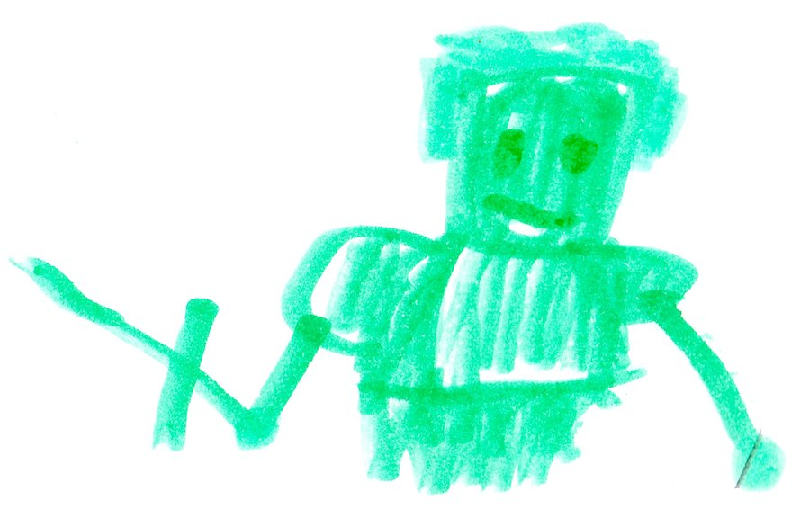

# The New World 

Felix was in a secret base when the door opened. Malek said, “Herobrine destroyed the last town.” Felix said, “Herobrine got the life lock key and killed Beckett; now he has the upper hand.” 

{width=400px}

*At the bad guys base...*

Herobrine said, “It has been a year since I killed Beckett and I still can't find the Life Gem.” I hid it  in my palm. Suddenly, I came back to life as the Life God. I said, “The Life Gem must have turned me alive again.” I went back to Felix's  base and found Felix. We talked and talked, and then I said, “That’s it! I'll talk to Cindy and Will and see if they want to take down Herobrine.” 
