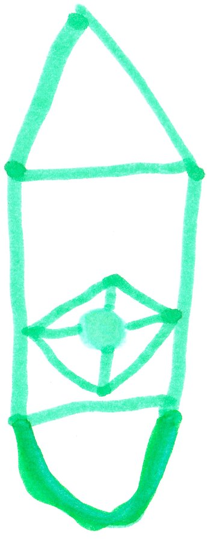

# The Last War

{width=75px}
{width=30px}
{width=75px}
{width=75px}
{width=75px}

Malek turned into the night God. I got my life sword; Malek got his night arrows and a night bow; and Mom got the ice machine. Suddenly Herobrine came out of a portal. Will said, “Herobrine, you boss  us around too much, now it's time for you to die.”

After a while Will destroyed his own heart -- the Nether Star -- to save us all. Will’s death caused Herobrine to lose the Fire Gem. Felix got the Fire Gem and turned into the Fire God. 

Eventually all of us were not able to fight. Dad as a ghost possessed me and fought Herobrine.  Felix said, “Wow, I never knew dad was so strong.”  But Herobrine still took Dad down. Then I had an idea.  

I fought for a while and then shut my eyes. Felix said, “Don't do it!”  Herobrine tried to punch me. I dodged it. Herobrine said, “What? He had his eyes closed.” After a while I open my eyes and threw a magic ball at Herobrine. Herobrine fell, and I cut his head to pieces. My team got the life lock key and saved the world. 

From that day on we were called...

**WORLD'S DEFENDERS**

